# Fitster - A fitness subscription & e-commerce application

Fitster is a fitness subscription & e-commerce application built to sell subscriptions and fitness products to customers in a simple, easy, and secure way and grow the business by increasing sales.

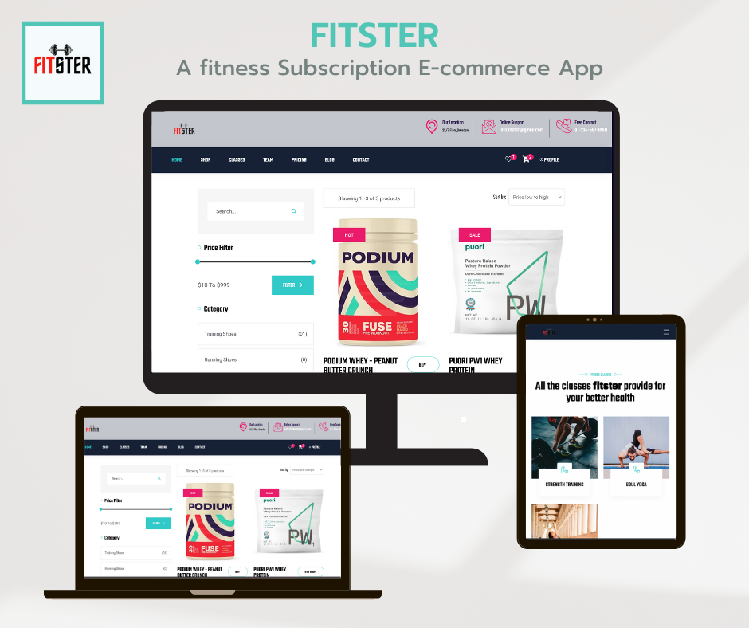

<p class="text-center">
Demo: <a href="https://fitster.herokuapp.com/" target="_blank">https://fitster.herokuapp.com/</a>
</p>


 &nbsp;


## Purpose

Fitster is designed and developed to sell fitness subscriptions and fitness products to customers so that customers can enjoy the benefits of a subscription and purchase products while the business owner can focus on growing the business.

The main purpose of Fitster is to build such a platform for a fitness/gym center that is secure and helps the business owners easily manage their business and the customers to purchase fitness subscriptions and fitness products. The application is designed with an MVC architecture and developed with modern technologies including Python3, Django, HTMX, Bootstrap, HTML5, SCSS, CSS3, Javascript, JQuery, and PostgreSQL to make the application secure, fast and user-friendly.

## Goals

### Project Goals

- Develop a web application to promote fitness classes, subscriptions, and products.
- Implement e-commerce features to sell fitness subscriptions and products to customers.
- Produce a secure and comprehensive backend structure for the application.
- Allow customers to create an account and log in to the application.
- Create an Admin access panel to manage the business and the customers.
- Allow customers to purchase fitness subscriptions and fitness products.
- Implement a payment system(Stripe) to allow customers to pay for their fitness subscriptions and products.
- Allow customers to review fitness products.
- Build a blog to share fitness tips and articles.
- Allow customers to create blog posts to share their success stories.
- Build a contact form to allow customers to contact the business owner.
- Design and develop a user-friendly and responsive website.

### Business Goals

- Increase sales by increasing the number of customers.
- Automate the process of selling fitness subscriptions and fitness products.
- Expand the business by adding more classes and instructors when required.
- Provide better customer service by providing a more personalized experience.
- Provide the best instructors and quality classes to the customers.
- Build a user-friendly and intuitive user interface to make the application more user-friendly.
- Retain customers by providing a better user experience from online shopping.

## Strategies

- Construct a secure and comprehensive backend structure following the MVC design pattern.
- Include a SQL(relational) database to store the necessary data.
- Use Python3 & Django to develop the backend of the application.
- Implement django-allauth to handle all the authentication processes.
- Use HTML5, SCSS, CSS3, Javascript, JQuery, and Bootstrap to design the front-end of the application.
- Handle ajax requests with HTMX to make the application more user-friendly.
- Give users the ability to create an account and log in to the application.
- Handle all the user interaction and user input through the front-end of the application.
- Implement Django forms to validate and handle user input, and django-crispy-forms to make the forms more user-friendly.
- Build user-friendly, responsive, and intuitive UI using Bootstrap and HTMX.
- Implement thumbnailer to resize images to fit the screen using sorl-thumbnail.
- Add markdown support for blog posts using django markdownx.
- Implement Django-Stripe and Stripe API to allow customers to pay for their fitness subscriptions and products.
- Build a monthly subscription model using Stripe to allow customers to pay for their fitness subscriptions recurringly.
- Create a customer dashboard to allow customers to manage their accounts, orders, and subscriptions.
- Create an admin dashboard to allow admins and business owners to manage the business and the customers.
- Store user contact information in the database and send emails to the business owner and admins.
- Implement AWS S3 to store static files and media files.
- Create a site map for the public pages of the application using the django sitemap module.
- Test backend of the application using pytest, pytest-django, pytest-factoryboy, and pytest-html.
- Handle errors in such a way that other developers can easily understand the issue.

## Diagrams Used in Development

This diagram was created at the beginning of the development process and is used to help the developer understand the application architecture.

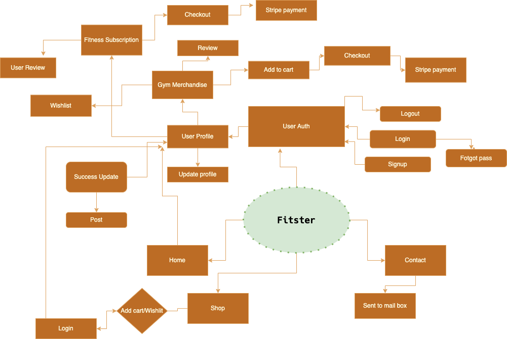

> The diagram is created from [app.diagram.net](https://app.diagrams.net/)

## Database Schema

A SQL(relational) database is used to store and access any associated data. SQlite is used in the development and PostgreSQL in production.

The following diagram shows the database models and the relationship between them with grouping and nesting.

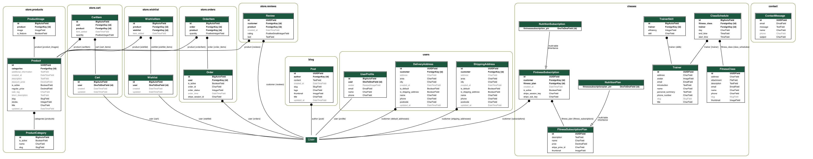

 The following diagram shows the database models and the relationship between them without grouping and nesting.

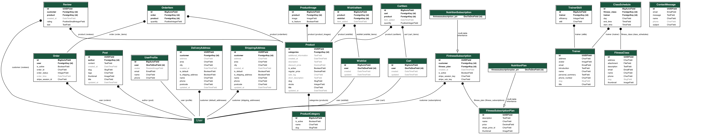

Dot file for the database schema: [db_schema.dot](readme/db_schema.dot)

> Dot file generated using Graphviz.

---

## Fitster Facebook Page

Here is the link of `Fitster` Facebook Page Mockup: [Fitster Facebook Page Mockup](readme/fitster_mockup.md)

## User Stories

User Stories are used to describe the user's goals and requirements. All the user stories are devided into three parts:

1. Guest User Story
2. Customer Story
3. Admin User Story

These user stories are documented on fitster repo project page using github's agile tool. The name of the project is `USER STORIES` and can be found in this link: [USER STORIES](https://github.com/SteveAlsamarae/fitster/projects/3). All the user stories are mapped to issues and pull requests to fulfill the project's goals.

## Create Subscription Plans

To create subscription plans and integrate with Stripe, go to the stripe dashboard and create a product and plans for the product.

    - Create a product.
    - Create a plan.
    - Create a subscription.

Now copy the price_id of the plan you created and paste it into the `price_id` field of the `Subscription` model from the admin panel.

Following the above steps, you will be able to create subscriptions and pay for them using Stripe.

## Features & Scopes

All the features are documented in [FEATURES](readme/features.md) readme.

## SEO

For the SEO of the application, the following steps are taken:

- Created sitemap for the public pages of the application using the django sitemap module.
- Created a robots.txt file to index the public pages of the application and to disallow crawling of the application's admin pages.
- Run Lighthouse to test the SEO of the application.

Below are some SEO results from Lighthouse:

> Lighthouse resutls for **Shop page**

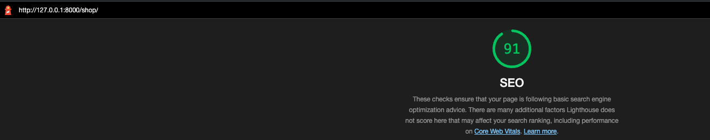

> Lighthouse resutls for **Classes page**


> Lighthouse resutls for **Blog page**

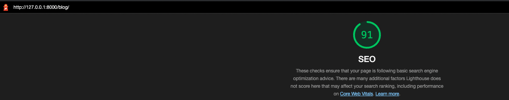

## Local Development

>❗ Make sure python3 and pip installed on the machine.

- Create a folder where to clone the project and cd into it.

Install a virtual environment manager if not installed. We use [Pipenv](https://pipenv.readthedocs.io/en/latest/).

For installing pipenv run

```bash
pip install pipenv
```

- Now clone the project and navigate to `fitster` folder.

```bash
git clone https://github.com/SteveAlsamarae/fitster.git
```

- Activate the virtual environment

```bash
pipenv shell
```

- Install all the local dependencies for the project

```bash
pip install -r requirements/local.txt
```

- Make sure in `manage.py` and `core/wsgi.py` to use `core.settings.local` for local development and `core.settings.prod` for production.

- Make sure to be in the project's root directory and run the following command

```bash
python ./utils/scripts/autoenv.py
```

- Now run the following command

```bash
python manage.py makemigrations

python manage.py migrate
```

- Now create a superuser

```bash
python manage.py createsuperuser
```

1. If all gone well you can now start the server

```bash
python manage.py runserver
```

> We have created some scripts to automate the process and some aliases to make the development process easier. These scripts are located in the `utils/scripts` folder.

To use the aliases and scripts run the following command

```bash
source ./utils/scripts/main.sh
```

Now we can just run the following commands to start the development server

```bash
env; mrun
```

> To use scss files make sure to have `SCSS` installed in the machine.

To install scss run

```bash
npm install -g node-sass
```

> Then run the following command to compile the scss files

```bash
sass static/scss/main.scss static/css/main.css
```

## Production

We have chosen to deploy the project on Heroku. To make the deployment process easier we have created a script to automate the process. This script is located in the `utils/scripts` folder. Before running the script make sure to assign the correct environment variables in the `utils/envs/env.sh` file. The following command will run the script:

```bash
source ./utils/scripts/deploy.sh

heroku_deploy
```

> Make sure to have installed the heroku cli tool and to have a heroku account.
> Make sure have a AWS account and create a S3 bucket and a user for the bucket. Then get the credentials for the bucket.
> Make sure to have a gmail account with two factor authentication enabled.

All the above steps is documented on the following link: [Details Deployment](readme/deployment.md)

## Error Handling

Errors are handled during the development process.

- Unit tested each app to handle unexpected errors.
- Manually tested frontend pages to avoid client-side errors.
- Tested templet syntax error to handle template syntax errors.
- Used pytest to handle errors.
- Used terminal logging to handle errors.
- Used console to handle known errors.
- Used Chrome DevTools.
  
## Testing

This project contains unit tests for each app as well as tests for templates. We have tested each view, model, and form of each app using the following tools and technologies:

- pytest
- pytest-django
- factory-boy
- pytest-factoryboy
- faker
- django's default test module

The front end is tested manually from the user end and admin end. We've also used chrome dev tools for front-end testing.

## Running Tests

To test all the apps of the project, follow the following procedures:

- For testing all the apps, run

```bash
pytest
```

or

```bash
pytest -rP
```

Last **unit tests** results on the project

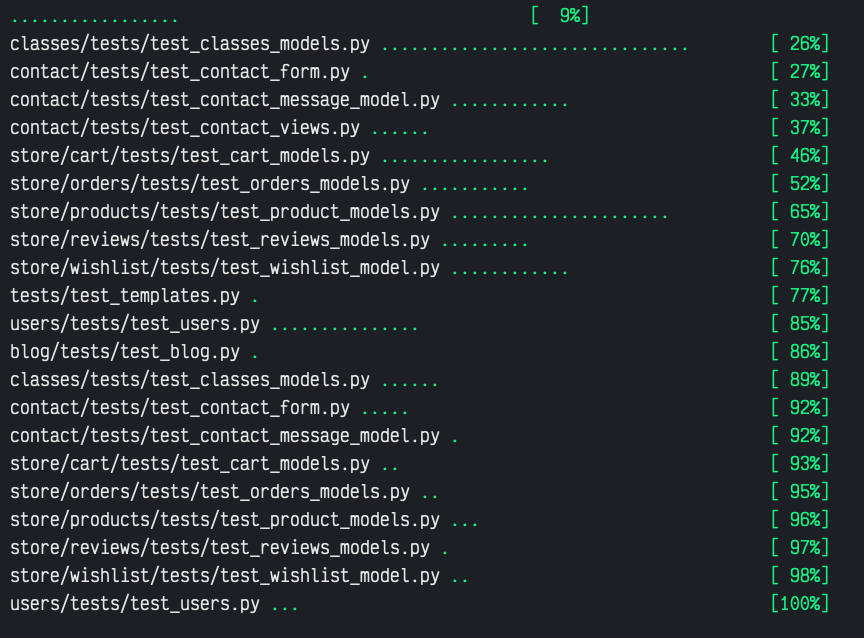
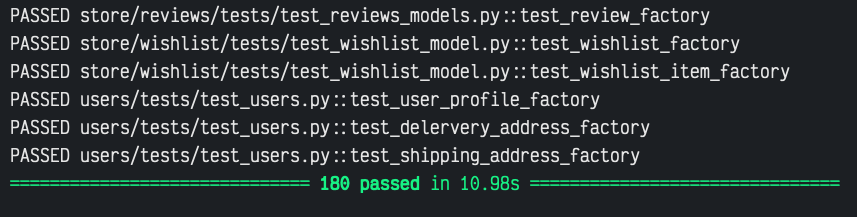

### Test Apps

- To test an app individually, run

```bash
pytest <APP_NAME> -rP
```

> -rP is optional

<details>
<summary>Last test results for classes app</summary>

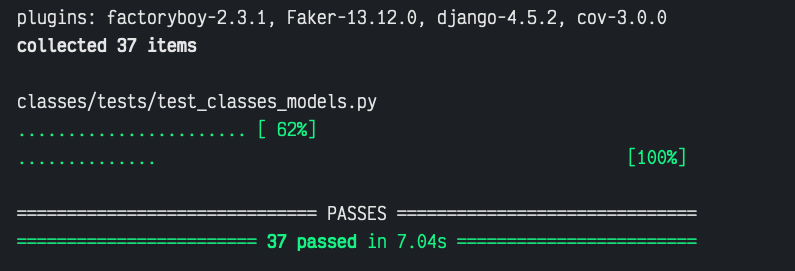
</details>

<details>
<summary>Last test results for users app</summary>

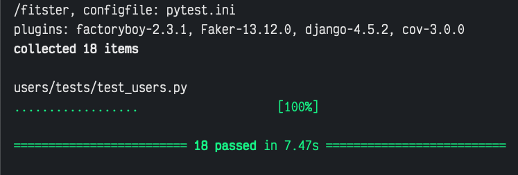
</details>

<details>
<summary>Last test results for products app</summary>

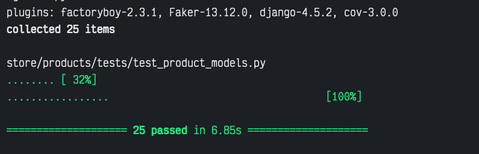
</details>

<details>
<summary>Last test results for reviews app</summary>

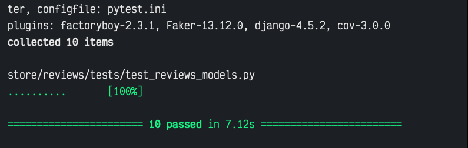
</details>

<details>
<summary>Last test results for wishlist app</summary>

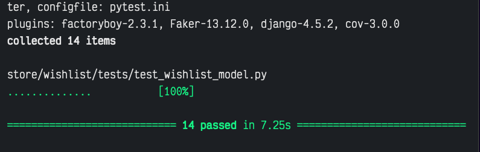
</details>

<details>
<summary>Last test results for cart app</summary>

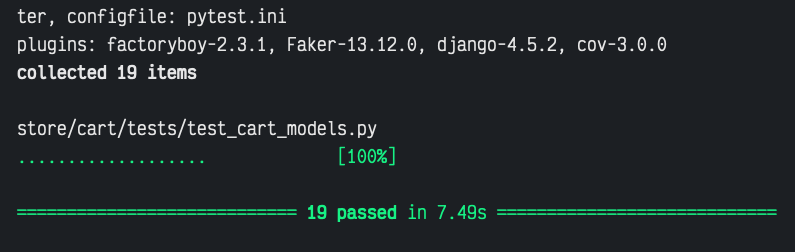
</details>

<details>
<summary>Last test results for orders app</summary>

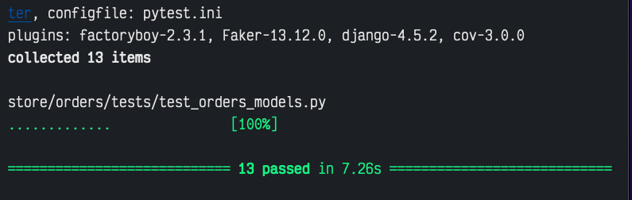
</details>

<details>
<summary>Last test results for contact app</summary>

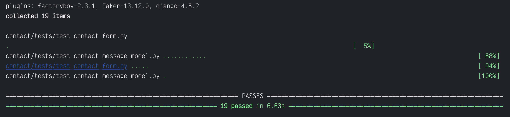
</details>

<details>
<summary>Last test results for blog app</summary>

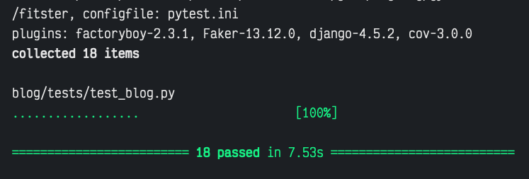
</details>

### Test templates

- To test all the templates using correct syntax, run

```bash
pytest tests/test_templates.py
```

<details>
<summary>Last test results for templates</summary>

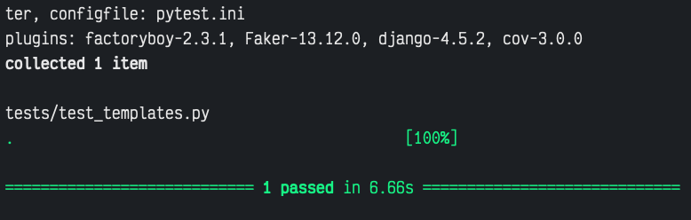
</details>

---

## Tools & Technologies

#### Languages

- [Python](https://www.python.org/)
- [Javascript](https://www.javascript.com/)
- [Bash](https://www.gnu.org/software/bash/)
- [HTML](https://developer.mozilla.org/en-US/docs/Web/HTML)
- [CSS](https://developer.mozilla.org/en-US/docs/Web/CSS)

#### Libraries and Frameworks

- [Django](https://www.djangoproject.com/)
- [Django allauth](https://django-allauth.readthedocs.io/)
- [Django-htmx](https://django-htmx.readthedocs.io/)
- [Dj-stripe](https://dj-stripe.readthedocs.io/)
- [Django-crispy-forms](https://django-crispy-forms.readthedocs.io/)
- [Sorl-thumbnail](https://pypi.org/project/sorl-thumbnail/)
- [Markdownx](https://django-markdownx.readthedocs.io/)
- [Pytest](https://docs.pytest.org/en/latest/)
- [Factoryboy](https://factoryboy.readthedocs.io/)
- [Faker](https://faker.readthedocs.io/)
- [HTMX](https://htmx.org/)
- [Jquery](https://jquery.com/)
- [Isotope.js](https://isotope.metafizzy.co/)
- [Nice-select.js](https://jqueryniceselect.hernansartorio.com/)
- [Swiper.js](https://swiperjs.com/)
- [Bootstrap](https://getbootstrap.com/)
- [SCSS](https://sass-lang.com/)

#### Databases and Storage

- [SQLite](https://www.sqlite.org/index.html): Used in local development
- [PostgresSQL](https://www.postgresql.org/): Used in production
- [AWS S3](https://aws.amazon.com/s3/): Used in production
- [Django local storage](https://docs.djangoproject.com/en/4.0/ref/files/storage/): Used in local development

#### Development Tools

- Git: Version controlling
- Github: Repository hosting
- Git Pod: For Continuous integration
- Code Institute GitPod Template
- Djhtml: For refactoring templates
- Debug toolbar: For debugging
- Django extentions: For boosting development speed.
- Black: Python code formatter
- Pylint: Python code linter
- Flake8: Tool for style guide enforcement
- JSlint: Javascript code linter
- JSHint: JavaScript Code Quality Tool
- Prettier: JavaScript code formatter
- Neovim: Vim-like editor for development
- VS Code: Main editor for development
- Iterm2: Terminal for development
- Chrome Dev Tools
- Lighthouse
- Drawio: For creating diagrams

## CREDITS

- Code institute
- Code Institute Slack Channel
- [Stack Overflow](https://stackoverflow.com/questions/tagged/django)
- [Django Documentation](https://docs.djangoproject.com)
- Udemy
- CS Dojo
- Telusko
- [Pexels](https://www.pexels.com/)
- [Pixabay](https://www.pixabay.com/)
- [Unslapsh](https://www.unsplash.com/)
- [Unslapsh](https://id.heroku.com/login/)